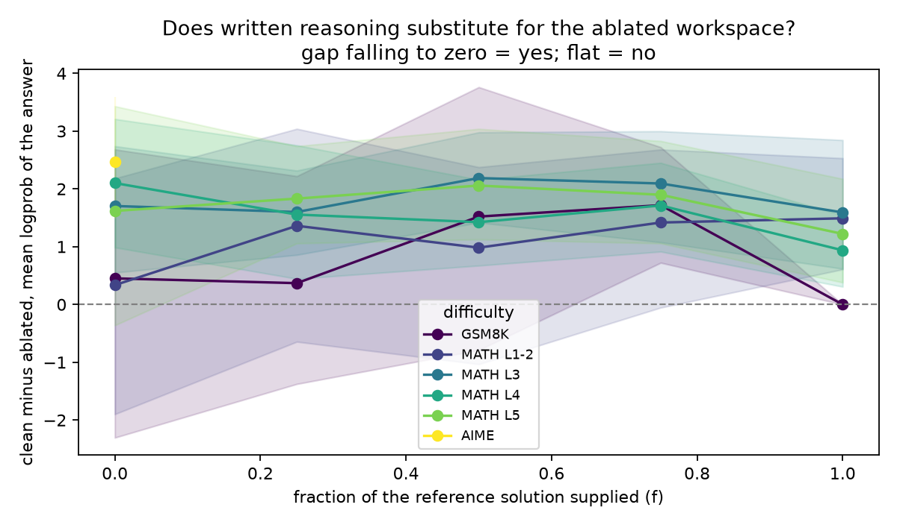
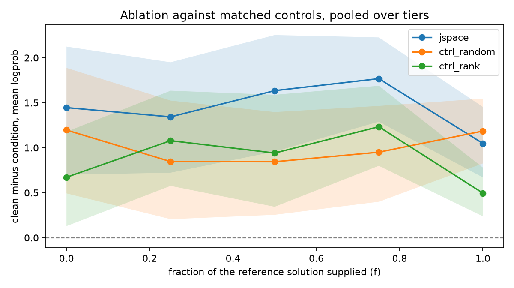

# What does written reasoning actually replace? A dose-response test of the J-space trade-off

**Homework Zero, Fall 2026, Qwen3-4B**
Assignment: https://boazbk.github.io/mltheoryseminar/hw0-2026/
Code: https://github.com/cs098890/cs2881-jspace

## Scope

This was done alongside a full-time internship and without access to a GPU. Given that, I
spent the time on understanding the paper and on the question of what separates a weak
experimental design from a strong one, and I deliberately kept the empirical component
small enough to run honestly on a laptop rather than large enough to look impressive. The
results below are underpowered, and where they are inconclusive I have said so rather than
reaching. The design reasoning, the controls, and the pre-registration are the parts I
would want read most carefully.

## Hypothesis

A model does an enormous amount of internal processing, but only a thin slice of it is the
kind of thing it could put into words if you stopped it and asked. The Jacobian lens reads
out that slice; the slice itself is the J-space, which the paper argues behaves like a
global workspace: a small, privileged working area sitting on top of a much larger volume
of automatic processing.

What matters here is what happens when you delete it. Ablating the J-space (zeroing the
residual stream's projection onto the top-k active lens vectors, at every token position,
across a band of middle layers) leaves most of the model intact: it still parses,
classifies, and recalls facts. What breaks is multi-step reasoning, **unless** the model is
allowed to write its steps down. GSM8K with chain of thought survives far better than the
same problems answered directly, which the paper reads as the model putting on the page what
it would otherwise hold in its head. The two scratchpads look interchangeable.

That rests on one dataset, and an easy one. Does the interchangeability hold as problems get
harder?

My prior is that it should not, and the reason is about *what kind of work* writing
offloads. Writing substitutes for internal workspace only for the bookkeeping. It does not
substitute for deciding what to write next. Long division on paper barely taxes working
memory: the paper holds every intermediate and the procedure tells you where to look, so the
choice of next step is not a choice at all. A proof is different. The paper holds the steps
already taken, but choosing the next one still happens in your head. Easy arithmetic is long
division; competition maths is the proof. If the J-space does the choosing rather than the
storing, the page should substitute well on GSM8K and progressively worse as difficulty
rises.

**H1'.** The gap between clean and ablated answer log-probability is largest when no chain
of thought is supplied, and closes as more of it is supplied. The value of `f` at which it
closes rises with difficulty.

Recorded in `PREREGISTRATION.md` before the run, along with the three results that would
falsify it and the outcome I expected.

## Experiment design

### The design I started with, and why I threw it out

The obvious experiment is the one the paper ran: generate a chain of thought under each
ablation condition, grade the final answer, compare. I built that first (it is still in the
repo as `scripts/run_experiment.py`) and then abandoned it, for a reason that is not about
compute.

Ablating the J-space changes what the model writes. So when accuracy drops, there are two
completely different stories that produce the identical number:

1. The model needed its internal workspace in order to reason *over* the page, and without
   it the reasoning failed.
2. The model wrote a worse page (skipped a step, made an arithmetic slip, wandered) and
   then reasoned over that damaged page perfectly competently.

Story 1 is about a workspace. Story 2 is about text quality. A generate-and-grade design
cannot tell them apart, because the thing being manipulated (the ablation) and the thing
being measured (the answer) are separated by a step that the manipulation also changes. The
paper's GSM8K result carries exactly this ambiguity, and I do not think it can be argued
away after the fact. It has to be designed out.

### The design I used instead

Do not let the model write the chain of thought. **Supply** it.

For each problem I take the reference solution written by a human, strip the stated answer
off the end so it cannot be copied, hand the model the first `f` fraction of it, and measure
the log probability the model assigns to the correct answer. Then I sweep `f` from 0 to 1.

- At `f = 0` the model gets the problem and nothing else. No external scratchpad.
- At `f = 0.5` half the derivation is on the page.
- At `f = 1` the entire derivation is on the page, but not the answer, so the model still has
  to take the last step.

This is a dose-response curve: how much does external reasoning have to be supplied before
the loss of the internal workspace stops mattering? Call the point where the gap vanishes
`closure_f`. Early closure means the page substitutes cheaply. Late closure, or none, means
it does not.

The critical property is that **the supplied text is byte-identical across every ablation
condition.** Clean and ablated runs see literally the same characters. The ablation
therefore *cannot* produce an effect by changing what got written, because it has no
opportunity to write anything. Story 2 above is closed by construction rather than argued
away. That is the entire reason for the redesign.

There is a second benefit that matters a lot at this sample size. Accuracy is binary: a
problem is right or wrong, so each problem yields one bit, and with a dozen problems per
cell almost nothing is resolvable. Log probability of the correct answer is continuous:
every problem yields a real number, and the same problem can be compared against itself
across conditions. That turns an underpowered accuracy experiment into a merely
underpowered continuous one, which is the difference between a run this size being worth
something and being worth nothing.

### Controls

A drop in performance after ablation proves nothing on its own. Removing ten directions
from the residual stream is a perturbation, and perturbations degrade models. The question
is whether *these particular* directions matter, so there are two controls, each isolating
a different alternative explanation.

**`ctrl_random`** removes k random directions and then rescales the removal so the residual
stream is displaced by *the same distance* as the real ablation displaced it at that same
position. Without the rescaling this control is too weak to be informative, because a random
direction is nearly orthogonal to the activation, so removing it barely moves anything, and
of course it does less damage. Norm-matching asks the sharper question: given a nudge of
exactly this size, does it matter which way you push? If `ctrl_random` reproduces the
`jspace` effect, then the effect is generic damage and there is nothing workspace-specific
here.

**`ctrl_rank`** removes lens vectors at ranks 1000–1010 instead of the top 10. Same family
of vectors, same geometry, same procedure, but contents the model is *not* currently
poised to say. This separates "lens-shaped directions are load-bearing" from "the actively
occupied ones are." It is the tighter of the two controls, because it differs from the real
ablation in exactly one respect.

Only a result where `jspace` separates from **both** controls supports the workspace
reading. Either control coming close collapses the interpretation.

### How this design can fail against me

I wanted the disconfirming result to be as visible as the confirming one, in the same plot,
without needing a separate analysis to surface it.

- **A flat gap in `f`** means the page does not substitute for the workspace at all, and the
  paper's interpretation of the GSM8K result does not generalise.
- **A gap that closes at the same `f` on every tier** means substitution works but its cost
  does not depend on difficulty, that is H1' dead, and it is the outcome I would consider
  most interesting if it happened.
- **No measurable gap even at `f = 0`** means the comparison is uninformative on this model
  rather than that the hypothesis is wrong, and is reported as a null rather than folded
  into a trend.

Difficulty is a six-point ladder rather than three datasets. MATH-500 carries its own level
labels, so splitting it into levels 1–2, 3, 4 and 5 puts resolution in the middle of the
range instead of only at the extremes. Using three datasets would have confounded difficulty
with dataset provenance and given me two usable points and one floor.

## Experimental details

**Model.** `Qwen/Qwen3-4B`, bfloat16, on Apple Silicon via MPS. Forward passes only, no
generation.

**Lens.** The logit lens, which is `J = I` in the paper's formulation. Code to fit true
averaged Jacobians is in `src/jspace/lens.py`, using a randomized estimator:
backpropagating `s = Σ_t' u·h_final,t'` for a random probe `u` yields `J_l,t^T u` at every
layer and position in one backward pass, and `E[u (J^T u)^T] = J`. I ran it at reduced
scale (2048 probes for `d_model` = 2560, layers 12–19) and then *checked* it rather than
trusting it (`scripts/validate_lens.py`). At that probe count the estimate is rank-deficient
and its readouts were not interpretable, top tokens at layers 17–19 were punctuation and
fragments, where the logit lens on the same activations gave `' countries'`, `' located'`.
Rather than build on a lens I could not validate, I used the logit lens. **This is the
single largest caveat on everything below**, and it cuts one way: a noisier proxy should
under-read the true effect, not manufacture one.

**Ablation.** At every position, in every layer of the medium band, rank lens vectors by
correlation against the residual stream, drop any token appearing in the clean pass's
top-10 (so we never ablate something the model was about to say anyway), take the top
`k = 10`, and remove the residual stream's least-squares projection onto their span. The
paper's percent-of-depth bands (38 to 70 for medium) are mapped onto Qwen3-4B's layer count
at load time, giving **layers 14–24**. The clean pass is also the baseline, so the
exemption costs nothing extra.

**Data.** GSM8K (`openai/gsm8k`, main/test) with `<<...>>` calculator annotations stripped
and the solution truncated at `####`. MATH-500 (`HuggingFaceH4/MATH-500`, test) split by
its own level field, with each solution truncated at the first `\boxed` so the answer never
leaks into the supplied text. **AIME 2025** (`yentinglin/aime_2025`, AIME I + II, 30
problems), chosen over AIME 2024 because Qwen3's pretraining window makes 2024 a
contamination risk. In this release AIME's `solution` field contains the bare answer rather
than a worked derivation, so **AIME can only appear at `f = 0`** and contributes nothing to
the dose-response curve. That is a real loss at the top of the difficulty ladder and it is
reported as such rather than papered over.

**Sample sizes.** 12 problems per tier, 6 tiers, 5 values of `f` (1 for AIME), 4 conditions
= **1,248 scored cells**. Total runtime 28 minutes on the laptop. All intervals are 95%
paired bootstrap over problems (4,000 resamples), so each problem contributes its own
clean-minus-ablated difference and the resampling is over problems rather than cells.

## Experimental results

**The supplied page works as intended.** Clean answer log-probability rises monotonically
with `f` on every tier, GSM8K from −4.37 to ≈0, MATH L5 from −4.48 to −1.16. Handing the
model more of the derivation makes it more confident in the right answer, so the dose axis
is doing what it is supposed to and everything downstream is interpretable.

**The ablation has a real effect, and it is partly specific.** Pooled over all tiers and
all `f`:

| condition | mean gap vs clean (nats) | 95% CI |
|---|---|---|
| `jspace` | **1.448** | [1.171, 1.713] |
| `ctrl_random` (norm-matched) | 1.012 | [0.747, 1.275] |
| `ctrl_rank` (ranks 1000–1010) | 0.876 | [0.653, 1.110] |

Paired against the real ablation, problem by problem:

- `jspace − ctrl_random` = **+0.436** [+0.226, +0.638], separates
- `jspace − ctrl_rank` = **+0.572** [+0.300, +0.816], separates

Both intervals exclude zero, which is the condition I pre-registered for the workspace
reading to survive. But the size matters as much as the sign: **the controls reproduce
roughly 60–70% of the effect.** Most of what ablation does here is generic damage, and only
about a third of it is attributable to which directions were removed.

**The gap does not close as chain of thought is supplied.** This is the headline, and it
goes against me. `closure_f` is undefined on **every** tier, the gap never falls inside its
own confidence interval of zero anywhere in the tested range.

| tier | gap at f=0 | f=0.25 | f=0.5 | f=0.75 | f=1.0 | closure_f |
|---|---|---|---|---|---|---|
| GSM8K | 0.45 * | 0.37 * | 1.52 * | 1.72 | 0.00 † | none |
| MATH L1-2 | 0.34 * | 1.36 * | 0.98 * | 1.42 * | 1.49 | none |
| MATH L3 | 1.70 | 1.60 | 2.19 | 2.09 | 1.59 | none |
| MATH L4 | 2.10 | 1.56 | 1.42 | 1.71 | 0.94 | none |
| MATH L5 | 1.62 * | 1.83 | 2.06 | 1.90 | 1.22 | none |
| AIME 2025 | 2.47 |, |, |, |, | none |

`*` interval includes zero. `†` ceiling artefact, see below.

Three tiers, GSM8K, MATH L1-2 and MATH L5, show **no measurable gap at all at `f = 0`**;
their intervals contain zero. That is the third outcome I pre-registered as a null, and for
those tiers the comparison is uninformative rather than negative.

The GSM8K `f = 1` cell is not a real closure. With the full derivation supplied, clean
log-probability is −0.000003, i.e. the model is already certain, so there is no headroom for
any intervention to show up. It is a ceiling, not a substitution, and should not be read as
`closure_f = 1`.

**One thing did trend with difficulty**, though not the thing H1' was about. The `f = 0` gap
rises across the ladder: 0.45, 0.34, 1.70, 2.10, 1.62, 2.47. With no external scratchpad,
harder problems are hurt more by the ablation. The intervals overlap heavily, so this is
suggestive rather than established.

## Analysis of results

**H1' is not supported.** I predicted the gap would be largest at `f = 0` and close as more
reasoning was supplied, with the closure point moving later on harder problems. What
actually happened is that the gap is roughly flat in `f`, it does not close on any tier,
including the easy ones where the paper's substitution effect should be strongest. Of the
three falsifying outcomes I named in advance, this is the first: *the page does not
substitute for the workspace*, at least not measurably, at least not here.

I want to be careful about how strong a claim that is, because the most likely explanation
is not that the paper is wrong.

**The lens is the prime suspect.** I used the logit lens as a stand-in for the Jacobian
lens. When I fitted real Jacobians at reduced scale and inspected them, they were not
interpretable, so I did not trust them enough to build on. But that means the thing I
ablated is "directions most aligned with the current output distribution," which is related
to the J-space but is not it. If the logit lens does not localise the workspace, then a flat
dose-response is a statement about my proxy, not about the model's workspace. The fact that
the effect is only ~35% specific relative to a norm-matched control points the same way: a
genuine workspace ablation should be far more specific than that. I would not describe this
as evidence against the paper. I would describe it as a null on a proxy.

**The ceiling eats the easy end.** By `f = 1` on GSM8K the answer is fully determined by the
supplied text, so log-probability saturates and no intervention can register. The dose axis
therefore has the least headroom exactly where the paper's effect is largest, which is an
unfortunate interaction between my metric and my design that I did not anticipate when I
pre-registered.

**AIME contributes almost nothing.** The release I used carries the answer in the `solution`
field rather than a derivation, so the hardest tier appears at `f = 0` only. It gives me the
single largest `f = 0` gap (2.47) but no curve, so the top of the difficulty ladder, the
part H1' is really about, is missing. If I were doing this again I would source worked AIME
solutions first and let that decide the design.

**Alternative explanations that stay open.** Qwen3-4B is ~two orders of magnitude smaller
than the models in the paper and may not organise a workspace the same way, or at all.
Answer log-probability is a proxy for problem solving, a model can put high probability on
a right answer it could not have produced end to end. And supplying a *human's* reference
solution measures the ability to use someone else's scratchpad, not one's own; if the
model's native chain of thought is represented differently from human text, the substitution
I measured is not quite the one the paper describes. That is the sharpest limitation of the
redesign and the price of closing the generation confound. I still think the trade was
right: the confound is fatal, this limitation is merely narrowing.

**What I would do next, in priority order.** Fit the Jacobians properly on two or three
layers, with enough probes to exceed `d_model`, and check whether the logit lens was
under-reading, that single change decides how much of this report survives. Then replace
log-probability with a measure that has headroom at high `f`, such as scoring a held-out
final *step* rather than the answer. Then raise n until adjacent tiers separate. Then use a
difficulty measure internal to one dataset, like required step count, so difficulty is not
confounded with dataset provenance. Finally, supply model-generated rather than human chains
of thought, so the scratchpad taken away and the scratchpad supplied are the same object.

## Use of AI

I used AI as a thought partner and for help in execution. The hypothesis, the decision to
abandon the generate-and-grade design, the dose-response redesign, the choice of controls,
and the interpretation of the results are mine. I remain responsible for understanding and
checking everything submitted here.

## References

Gurnee, W. et al. (2026). *Verbalizable Representations Form a Global Workspace in Language
Models.* Transformer Circuits Thread, Anthropic.
https://transformer-circuits.pub/2026/workspace/index.html
